# U.S.-Healthcare-Wait-Times-Analysis
# 📌 Project Background 

One of the main reasons driving our decision in focusing on US Healthcare wait times was noticing the growing trend of how long it takes to get an appointment now compared to just a few years ago. Waiting for an extended period of time is something no one enjoys going through, but looking into the data collected by OECD we can see that just over the course of 6 years (2010-2016) patients waiting more than 1 month grew from 17 to 27 percent (OECD). Of course this could just be due to the fact that there are more people in the United States and as such waiting for an appointment would take longer, but we wanted to dive deeper to see what specific specialities may be more impacted and what age groups of patients wait longer.

Our project questions include:
- Is there a specific type of patient waiting a long time?
- How long do the patients wait before the doctor can see them?
- What type of staff do the hospital need?
- What days of the year are the busiest?
- How can we fix it?

This project uses the datasets from [dataset](https://www.kaggle.com/datasets/ahmedshahriarsakib/usa-real-estate-dataset/data).

<i>In collaboration with Fazil Ahmed, Richa Kapuskari, Shri Hari Sekar, Ziyue Zhang.</i>  

# 📊 Data Pre-Processing  
1. Merging all dataset files:
  Combining all the four inpatient data files into one and outpatient data files into the other to make the analysis easier when running the machine learning algorithms. Below the code for combining the dataset files can be seen.
   
      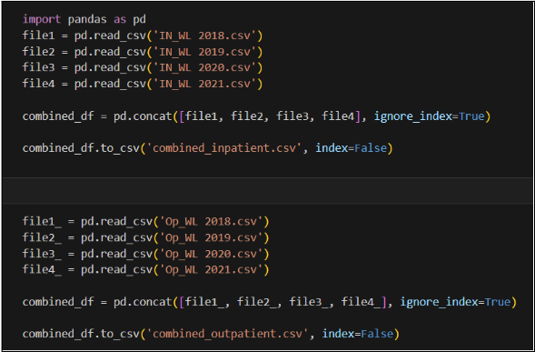
   
   
2. Missing Values:
  The next step involved searching the rows to locate and determine if there were any null values. The search results yielded that there were no missing null values in any rows. However, the unnamed column was entirely empty and as such it was better to drop  that column in the analysis. The search results for this entire search can be seen below.
   
      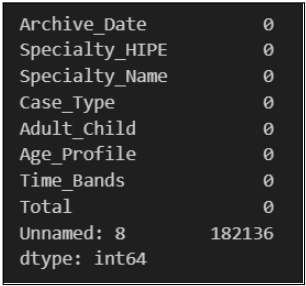
   
  
3. Handling Categorical Data:
  The Age_Profile column had a range of ages divided into 0-16, 16-64, and 65+. This reflects the US methodology of categorizing people into working and non-working age populations. To make the analysis of the categorical data easier the decision was made to convert it to a dummy variable. Time_Bands was another variable which had a range of months for the wait time, so it was converted into numerical data. And finally, we dropped the Adult_Child column during implementation of the machine learning model because the Age_Profile is sufficient enough to tell if the person is an adult or child. The final code for our changes is shown below.
   
      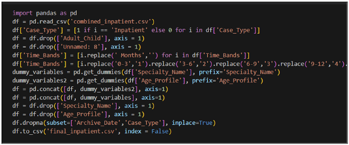
   

# 👣 Model Selection and Training  
Naive Bayes, Logistic Regression, and Decision Tree are all three machine learning algorithms that can be used to deduce and determine a distribution of inputs based on a specific factor. This would test how correlated the input of information is and if we can make assumptions on the dataset at hand. The specific factor we wanted to use as our target value for testing was Time_Bands as that is the determining factor of how long a single patient ends up waiting for an appointment after they schedule it. Lastly, for our visualizations we chose to utilize Power BI as it effectively shows all the ins and outs of the patient data and allows us to utilize various graphs and charts to get a better idea of showing the information that has been collected.
   
      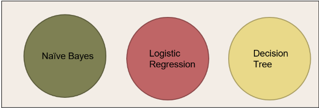
   
  
1. Naive Bayes:
  It is a simple, effective model and easy to implement. It also works well with large and categorical datasets. This perfectly suited our needs as most of the healthcare data was categorical. Below we have pasted the code we used as well as its associated confusion matrix.
   
      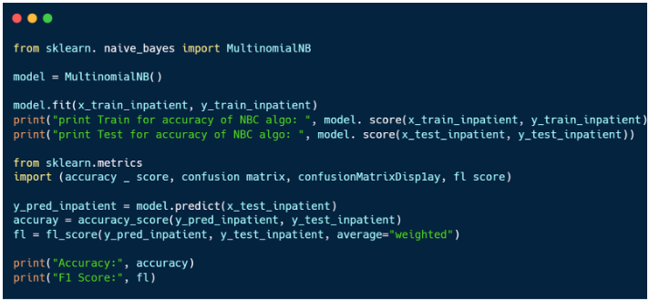
   
   
      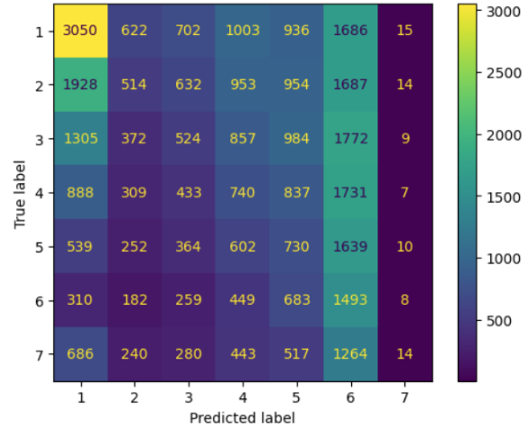
   
  
2. Logistic Regression:
  Logistic regression can scale effectively to large datasets and is less prone to overfitting. It tends to work better with smaller training sets too, which is beneficial considering the size of this dataset was not too large. As a result the test set itself would not be large either. Below is the code we used for the logistic regression model.
   
      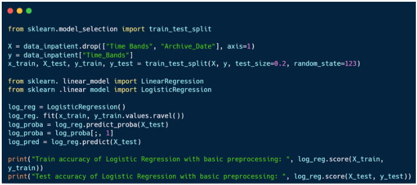
   
  
3. Decision Tree:
  Decision trees are a versatile and generally a powerful machine learning algorithm. It works well with large datasets and can be combined into ensemble methods and  provide a measure of feature importance, indicating which features are more influential in making predictions. Below is our code & confusion matrix for the model.
   
      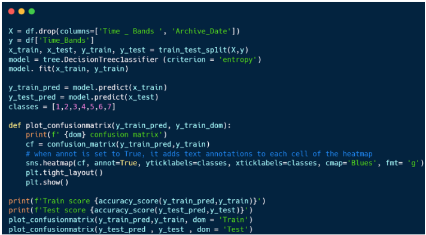
   
   
      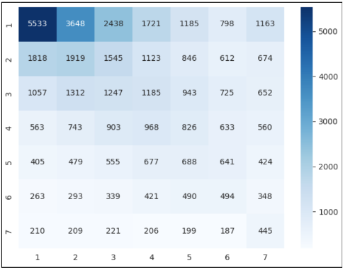
   
  
#### Model Evaluation:
   
      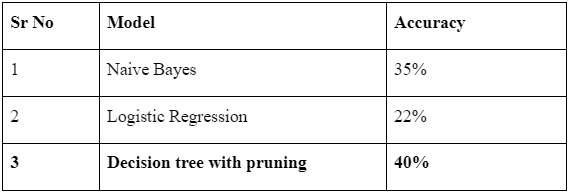
   

The final results for each machine learning model can be seen in the chart above. There are a few key takeaways from the overall accuracy and what we learned from it after cleaning up the data.
- The dataset is not made for machine learning models. This is a known issue within the medical industry as “the lack of clean, structured data is an overarching problem for organizations across every industry, but training and deploying value-adding machine learning models at scale requires companies to reimagine their approaches to data governance. Given that datasets from one organization rarely suffice for model training, engineers typically resort to obtaining patient data from other healthcare organizations. The problem is that the majority of these datasets are incompatible with each other” (Koptelov).
- Our target variable in the dataset contains multi-level classification (target variable has 7 classes), and as such it was more likely to generate a model with lower accuracy.
- The parameters recorded by the hospital do not provide a deep level of insight. For example, adding a column that indicates which doctors may or may not be at the hospital might provide more information as to why some departments are more impacted than others.
- Decision Tree with pruning having the highest accuracy level does show that even though our target variable had multi-level classification that the other points of data do provide a somewhat significant level of information gain that helps provide insight into why some may have longer wait times than others.
- There is always the possibility that data is simply random, and as such cannot be discerned. However, we will still utilize visualizations to see if this does hold true.

# 🧽 Data Visualizations & Insights:
1. Yearly Total Number of Inpatients vs. Outpatients:
   Between 2018 and 2020, the distribution of total inpatients and outpatients was even according to the charts. Notably, throughout this period, the number of inpatients consistently surpassed that of outpatients. The year 2020 witnessed peak figures for both inpatients and outpatients, potentially influenced by the COVID-19 outbreak.
    
      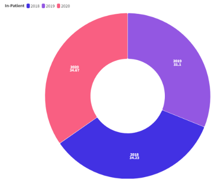
    
    
      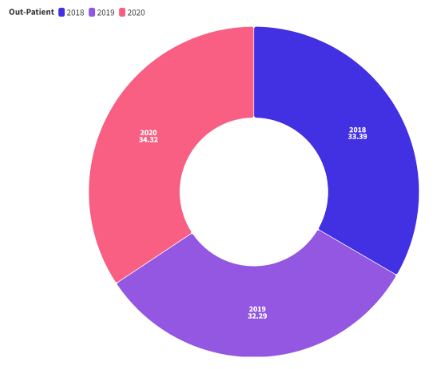
    
   
2. Age Group of Inpatients vs. Outpatients:
   The age dependency ratio defines the connection among three population segments: ages 0-15, 16-64, and 65+. It delineates the "dependent population" (ages 0-15 and 65+) from the "working age population" (ages 16-64), aligning with the U.S. Bureau of Labor Statistics' definition. As per the data it appears that those in the working age population wait the longest, followed by those who are expected to be retired.
Number of inpatients and outpatients by age group: 16-64 > 65+ > 0-15.
    
      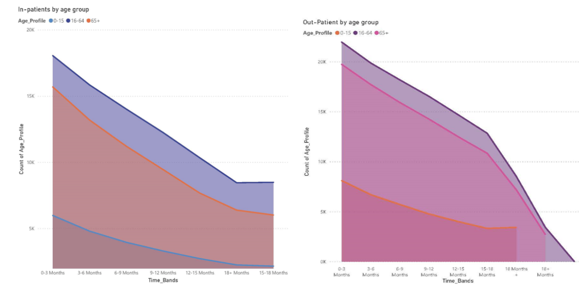
    

3. Percentage of Inpatients vs. Outpatients by Time Band for Cardiology:
   The time band ranging from 0 to 3 months displays the highest percentage of cardiology inpatients, whereas the period between 15 to 18 months shows the lowest percentage.
The time band of 0 to 3 months shows the highest percentage of cardiology outpatients.
There's a slight difference in percentages among the time bands of 0-3 months (18.20%), 3-6 months (17.06%), and 6-9 months (16.29%).
This small variance implies an almost uniform distribution, indicating treatment duration corresponding to the severity of cardiology issues. In contrast, time spans exceeding 18 months exhibit the lowest percentage. This shows that for more serious procedures or visits, such as those pertaining to the heart that the hospital does prioritize those but even then more than 70% occur between 0-9 months which is an incredibly wide range.
    
      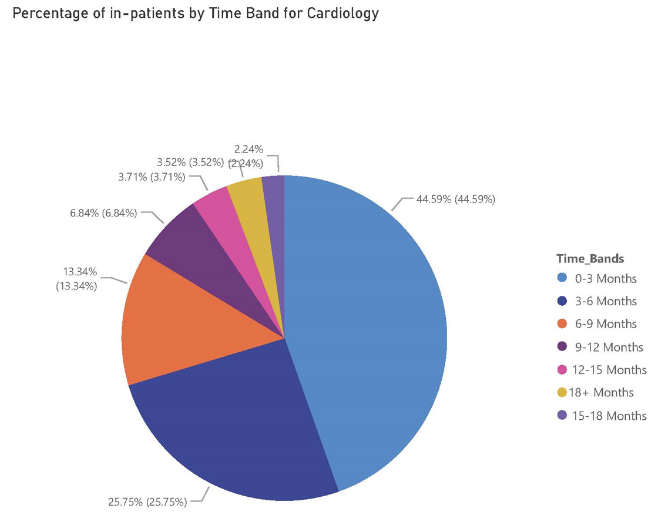
    

4. Time Band Comparison of Inpatients vs. Outpatients: Identifying Peak waiting Period:
   The heat map above indicates that March has the longest wait time period for inpatients considering the data range of 2018 to 2021.
Conversely, it can be seen that December tends to have the lowest wait time period throughout the year.
Regardless of the month, inpatients typically await treatment for a span of 0 to 3 months. However, it does need to be stated that a similar percentage of patients must also wait 3 to 6 months which most would find unacceptable.
    
      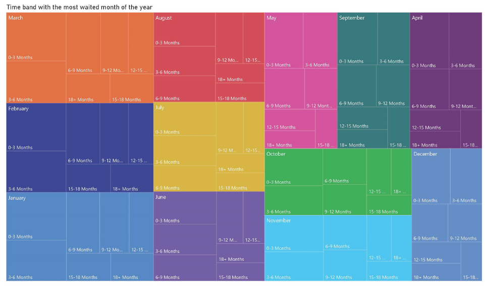
    

   The heat map below indicates that March has the longest wait time period for outpatients considering the data range of 2018 to 2021. Whereas, April trends to the lowest wait time period throughout the year.
Regardless of the month, outpatients typically await treatment for a span of 0 to 3 months. However, the first 3 months of the year, the time bands of 3 to 6 months is almost equal to 0 to 3 months.
    
      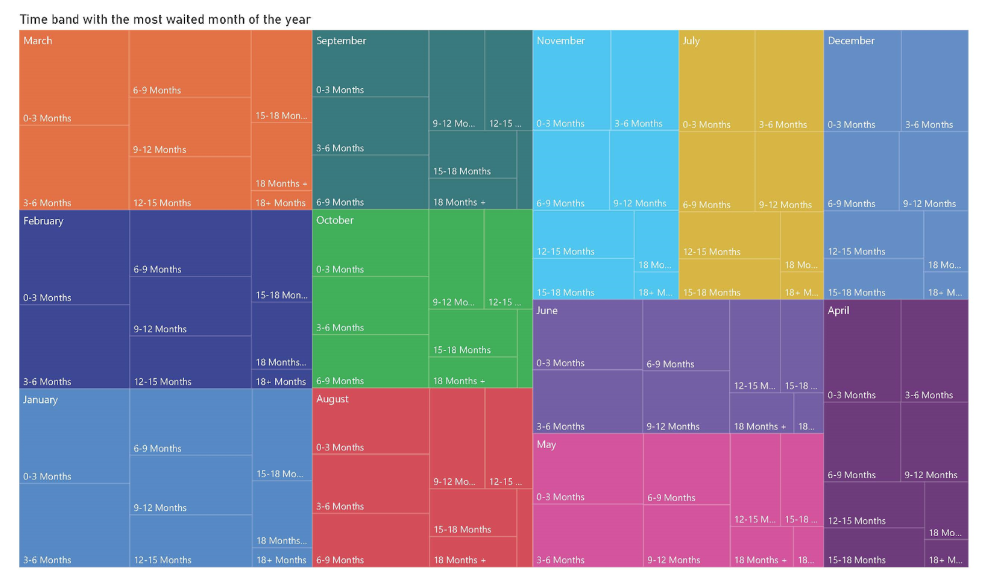
    

5. Wait Time by Specialty:
   The below charts indicate that the people waiting in the time band 0-3 months lead the dataset and account for about 35% of the total data procured. This is followed by those who wait 3-6 & 6-9 which account for over 36%. More patients are waiting longer than 3 months than those who are not.
    
      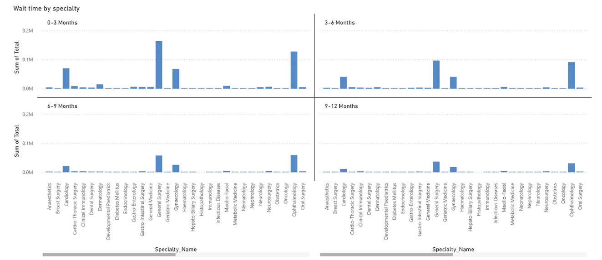
    
    
      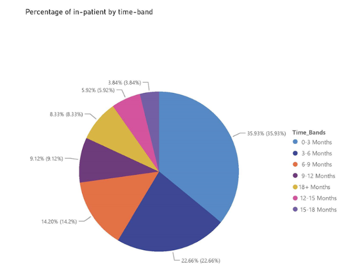
    
   Out of many different specialties, General Surgery ranks the top among the most awaited specialty over others followed by Orthopaedics and Gynaecology by time band. It should be noted that this occurs because General Surgery likely has the highest raw number of patients to be expected, but even then the percentage of outpatient Time_Bands breakdown shows that the vast majority of patients are all waiting longer than 3 months.
    
      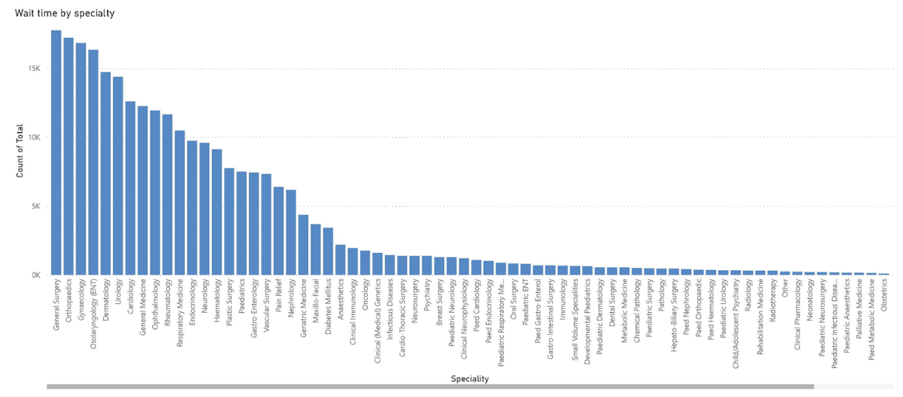
    
    
      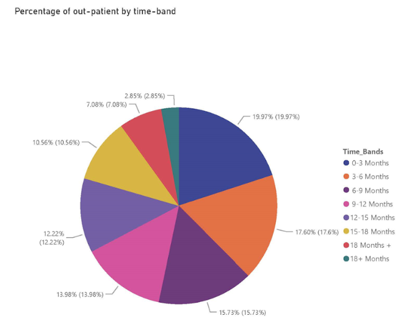
    

# 🔑 Recommendations
Based on all of our findings we have a few specific recommendations this hospital could take in regards to improving its patient wait times. They are as follows:
- Better record keeping. Tabulate number of doctors on-site along with specialty. This would improve the record keeping data they have on hand and allow them to understand when and why they have to push appointments out so far back as well as which departments are impacted more heavily.
- Higher number of doctors available during the first 3 months of the year. January-March has the highest number of patients overall across all years, and because of this it would be best to have more staff on hand to help support this increase.
- The hospital should investigate adding more surgeons as general surgery has the highest number of patients and tends to have longer wait times as well.
- Identifying the scheduling cardiology does to improve other departments. Cardiology by far had the highest rate and percentage of appointments booked in the 0-3 month time span, and because of this it could provide insights into how other departments would be able to improve their scheduling as well. It does need to be stated that cardiology and things pertaining to the heart may be more severe or time sensitive, but regardless the hospital should investigate this phenomenon.
- Offer more ways to have scheduled appointments and then record those appointment types in a separate column. With the advent of COVID-19 telehealth became more viable and acceptable as a means to schedule doctor’s appointments. This is something that the hospital could leverage as it would reduce both patient travel time and allow doctors more flexibility for when they themselves may be on-site. In a similar manner to improving record keeping, this would allow the hospital to have more data on hand and then formulate better methodologies for improving wait time efficiency going forward.

# ☁️ Conclusions
While this dataset was not necessarily compiled with machine learning algorithms in mind, it can be seen that visualizations do help illustrate and give a better understanding of what is going on. In regards to the dataset itself, as mentioned in the recommendations section, they could benefit tremendously by improving their record keeping. However, it needs to be noted that “​in real medical data sets, missing values are frequently present and most patients’ records lack certain data. This can be a result of certain tests not performed or certain questions that were not asked (Kononenko, 2001; Cios and Moore, 2002; Bellazzi and Zupan, 2008). Therefore, medical mining systems have to be able to appropriately deal with such incompleteness of the data. Some data mining approaches are robust to missing values while other approaches deal with this requirement through preprocessing of the data. In addition to missing values, medical data are characterized by their incorrectness, inconsistency, redundancy, sparseness and inexactness” (Othman). This is an issue that is prevalent around the entirety of the medical field and not likely to improve until hospitals and healthcare providers feel pressure to improve their record keeping abilities.

Another key takeaway is that hospital wait times for a standard US hospital are simply too long for most people. The promise of privatized healthcare offering better patient care and speedier appointments does not hold true to our dataset and the few studies we have cited throughout this report. In nearly every specialty across inpatient & outpatient record types more than 50% are waiting more than 3 months for an appointment. This is unacceptable and presents a disconnect between healthcare providers and the patients they are serving. And while things such as scheduled procedures and checkups that are designed to be more than 3 months away do exist, they are usually very uncommon and likely account for a small portion of appointments in our dataset. Furthermore, the hospital would have no way of telling if those appointments need to be scheduled so far out because they do not keep track of information pertaining to that.

In summation there are clearly multiple ways to look at this dataset and we have provided various solutions and insights above. However, it just goes to show that there truly are never enough doctors, nurses, or healthcare staff in the world. Not even in a country known to have the best medical professionals in the world. There will always be ways to improve efficiency and the healthcare industry is not exempt from that.

